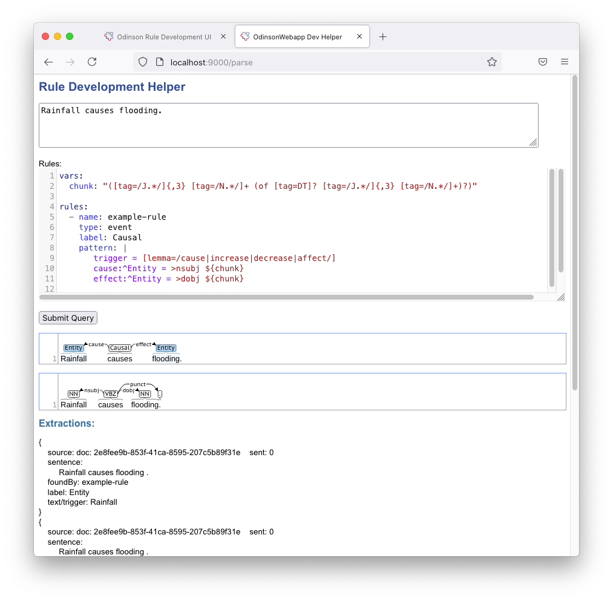

# OdinsonWebapp


This is a webapp designed to facilitate Odinson rule development.
Odinson is a highly optimized information extraction framework that 
supports *real-time* queries against an indexed corpus.
For more information, please see [Odinson's documentaion](https://github.com/lum-ai/odinson).

To use this webapp, I assume you already have an [Odinson index made](http://gh.lum.ai/odinson/making_index.html), using Odinson version 0.4.x.

 - Point the webapp to the index (not the parent dir).  In `src/main/resources/application.conf` 
 set: 
    
        odinson.indexDir = "path/to/index"

- on the command line, run: 

        sbt webapp/run
        
This will launch the webapp.  Then, in a browser, go to `localhost:9000`

You should see something like this:


To try out a rule, hit the `SUBMIT` button.
Results are displayed in a table, initially sorted by frequency.


To see the supporting evidence, click the `+` button for the row.


To export the contents of the table, select `export matches` and slick `submit`.
The matches will be saved as a json lines file (i.e., one json object per match, one per line).
The file will be saved in the current directory, in a file named by the rule name concatenated
with the local datetime (e.g., `example-rule_2020-04-08_10:47:36.jsonl`).


## Parser view (New!)

If you want to see what a set of rules will extract from a particular sentence, you can use the endpoint:
 
    localhost:9000/parse

In this view, you can add rules and a text and view the extractions.  Also shown is the syntactic annotation information _using a CluProcessor_. (Meaning that it may not match what you used to make the index, but it's likely to be informative since the parser is trained on universal dependencies.)
Please note that the first query you submit will be a little slow.



## Docker

You can build this into a container with:

```
sbt "project webapp" "dist"
docker build -t odinsonwebapp .
```

This generates a container named `odinsonwebapp`, which can be run using:

```
docker run -it --rm -v $PWD:/root/webapp -p 9000:9000 -d odinsonwebapp
```

Note that the index for the Docker container is expected to be located in `docker/index` at the top level of this repository. You also need to ensure that `src/main/resources/application.conf` has `odinson.indexDir = "/root/webapp/docker/index"` for its index. You can either place your index at `docker/index` or mount some other index directory. If, for example you were to mount `/localhost/data/index` to `/index` with `-v /localhost/data/index:/index` you should update `src/main/resources/application.conf` so that `odinson.indexDir = "/index"`.

Additionally, you'll note that the top-level directory is mounted at `/root/webapp` in the Docker run command. This is so that you can save a rule file in this directory and send that to the `/process_text` API endpoint. So, if your rule file is called `rules.yml`, you would send the request as:

```
curl --header "Content-Type: application/json"  --request POST --data '{"rulefile":"/root/webapp/rules.yml","text":"Text string to process."}' http://localhost:9000/process_text
```

If you wish/require to locate your rule file elsewhere, make sure to mount that directory as a volume and then specify the appropriate container path in your `POST` request.

> Note: if you only with to use the `/process_text` API and not the web app, you do not need to specify an index.

Any feedback is much appreciated!
