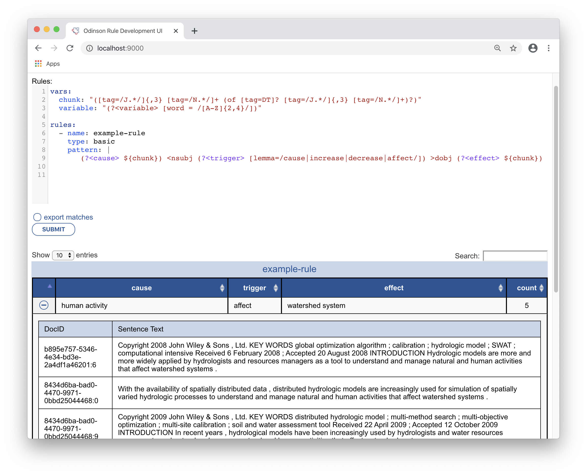

# OdinsonWebapp


This is a webapp designed to facilitate Odinson rule development.
Odinson is a highly optimized information extraction framework that 
supports *real-time* queries against an indexed corpus.
For more information, please see [Odinson's documentaion](https://github.com/lum-ai/odinson).


To use this webapp, I assume you already have an [Odinson index made](https://github.com/lum-ai/odinson/tree/master/extra).

 - Point the webapp to the index (not the parent dir).  In `src/main/resources/application.conf` 
 set: 
    
        odinson.indexDir = "path/to/index"

- on the command line, run: 

        sbt webapp/run
        
This will launch the webapp.  Then, in a browser, go to `localhost:9000`

You should see something like this:


To try out a rule, hit the `SUBMIT` button.
Results are displayed in a table, initially sorted by frequency.


To see the supporting evidence, click the `+` button for the row.



To export the contents of the table, select `export matches` and slick `submit`.
The matches will be saved as a json lines file (i.e., one json object per match, one per line).
The file will be saved in the current directory, in a file named by the rule name concatenated
with the local datetime (e.g., `example-rule_2020-04-08_10:47:36.jsonl`).


## Docker

You can build this into a container with:

```
docker build -t odinsonwebapp .
```

This generates a container named `odinsonwebapp`, which can be run using:

```
docker run -it --rm -v $PWD:/root/webapp -p 9000:9000 -m=4gb -d odinsonwebapp
```

Note that the default index for the Docker container is located in `docker/index`. If you want to build the container with a different index, you should replace this. You also need to ensure that `src/main/resources/application.conf` has `odinson.indexDir = "/root/webapp/docker/index"` for its index.

Additionally, you'll note that this directory is mounted at `/root/webapp` in the Docker run command. This is so that you can save a rule file in this directory and send that to the `/process_text` API endpoint. So, if your rule file is called `rules.yml`, you would send the request as:

```
curl --header "Content-Type: application/json"  --request POST --data '{"rulefile":"/root/webapp/rules.yml","text":"Text string to process."}' http://localhost:9000/process_text
```

If you wish/require to locate your rule file elsewhere, make sure to mount that directory as a volume to `/tmp`.

Any feedback is much appreciated!
